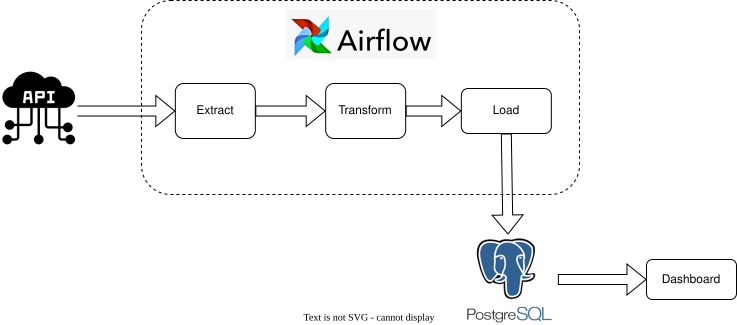

# Extract-Transform-Load Pipeline Project

A production-ready ETL pipeline that automatically extracts energy mix data from ECO2mix, transforms it with quality checks, and loads it into PostgreSQL for analysis and visualization.

## Overview

This project is an end-to-end workflow which aims to query ECO2mix data on a regular basis, process it by applying multiple transformations, store it in a PostgreSQL database, and load the data to a visualization dashboard.

ECO2mix is a dataset refreshed once per hour, presenting "real-time" regional data from the eCO2mix application. The data comes from telemetry of the structures, supplemented by packages and estimates.

**Data available every 15 minutes:**
- Production according to different sectors composing the energy mix
- Consumption of pumps in Energy Transfer Pumping Stations (STEP)
- Balance of physical exchanges with neighboring regions

For more information, visit the [ECO2mix Open Data Portal](https://odre.opendatasoft.com/explore/dataset/eco2mix-regional-tr/information/?disjunctive.libelle_region&disjunctive.nature)

## Features

- ✅ **Automated scheduling** using Apache Airflow
- ✅ **Data validation** and transformation pipelines
- ✅ **Real-time visualization** dashboard
- ✅ **Containerized deployment** with Docker
- ✅ **PostgreSQL** data storage
- ✅ **Scalable architecture** for production use

## Project Stack and Architecture



**Technology Stack:**
- **Orchestration:** Apache Airflow
- **Data Processing:** Python
- **Database:** PostgreSQL
- **Containerization:** Docker & Docker Compose
- **Visualization:** Dashboard UI

## Table of Contents

- [Prerequisites](#prerequisites)
- [Installation](#installation)
- [Quick Start](#quick-start)
- [Running Airflow and Managing DAGs](#running-airflow-and-managing-dags)
- [Visualizing the Data](#visualizing-the-data)
- [Project Structure](#project-structure)
- [Troubleshooting](#troubleshooting)
- [Contributing](#contributing)
- [License](#license)

## Prerequisites

- **Docker Desktop** 4.x or higher
- **Docker Compose** 2.x or higher
- **Git**
- At least 4GB available RAM
- Docker daemon must be running

## Installation

### Setup

To install the project environment, ensure Docker Desktop is running, then execute:

```bash
docker-compose up
```

This command will:
1. Build all required Docker images
2. Start Airflow, PostgreSQL, and the visualization service
3. Initialize the database

### On Code Changes

If you modify code, you may need to rebuild the containers:

```bash
docker-compose down
docker-compose up -d --build
```

### Reset Everything

If `docker-compose up` keeps failing, reset the environment:

```bash
docker-compose down --volumes --rmi all
docker-compose up
```

### Force Recreate Without Cache

To force Docker to recreate images without using local cache:

```bash
docker-compose up --force-recreate
```

## Quick Start

1. **Clone the repository**
   ```bash
   git clone https://github.com/sambafall/etl-pipeline-energy-data.git
   cd etl-pipeline-energy-data
   ```

2. **Start the services**
   ```bash
   docker-compose up
   ```

3. **Access Airflow UI**
   - Open http://localhost:8080 in your browser
   - Login with credentials:
     - **Username:** airflow
     - **Password:** airflow

4. **Activate and run the DAG**
   - Click on the **DAGs** tab
   - Locate the "process-energy" DAG
   - Click the toggle to activate it
   - Click the play icon to trigger the pipeline manually

5. **View the results**
   - Once the DAG completes successfully, open http://localhost:8000
   - Browse the energy data visualization dashboard

## Running Airflow and Managing DAGs

### Access Airflow Web UI

Open your browser and navigate to:
```
http://localhost:8080/login
```

### Login Credentials

- **Username:** airflow
- **Password:** airflow

### Manage DAGs

1. Click on the **DAGs** button in the sidebar
2. Find the "process-energy" DAG in the list
3. Use the toggle switch to enable/disable the DAG
4. Click the play icon to manually trigger a run
5. Monitor execution in the DAG details view

## Visualizing the Data

Once the DAG has run successfully, view the processed data:

```
http://localhost:8000
```

This dashboard provides:
- Real-time energy production data
- Regional energy mix breakdown
- Historical trends and analysis
- Interactive filtering and exploration

## Project Structure

```
etl-pipeline-energy-data/
├── dags/                    # Airflow DAG definitions
├── src/                     # Python application code
│   └── app.py              # Main application logic
├── config/                 # Configuration files
├── assets/                 # Documentation and diagrams
├── docker-compose.yaml     # Service orchestration
├── Dockerfile              # Image build configuration
├── requirements.txt        # Python dependencies
└── README.md              # This file
```

## Troubleshooting

### Issue: `docker-compose up` fails immediately

**Solution:** Reset the environment:
```bash
docker-compose down --volumes --rmi all
docker-compose up
```

### Issue: Airflow UI shows no DAGs

**Solution:** Wait 30-60 seconds for Airflow to scan the DAGs folder, then refresh your browser.

### Issue: Database connection errors

**Solution:** Ensure PostgreSQL is running by checking logs:
```bash
docker-compose logs postgres
```

### Issue: Port already in use (8080, 8000)

**Solution:** Stop conflicting services or modify the `docker-compose.yaml` port mappings.

### Issue: Out of memory errors

**Solution:** Allocate more RAM to Docker Desktop (Settings → Resources → Memory).

## Contributing

We welcome contributions to this project! 

If you encounter a bug or find something unclear:
1. Check existing issues to avoid duplicates
2. Submit a detailed bug report with steps to reproduce
3. Include relevant logs and error messages
4. Propose improvements via pull requests

## License

Released under the [MIT License](LICENSE.txt)

---

**Last Updated:** 2026-05-22
